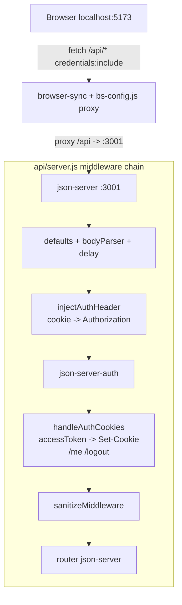

# design.md — Autenticação via Cookie HttpOnly

**Spec**: `.specs/features/auth-cookie-httponly/spec.md`
**Status**: Draft

> Este documento é autocontido: a implementação não depende de documentos
> externos a `.specs/`. Todo código necessário está especificado aqui.

---

## Architecture Overview

Duas mudanças se combinam: (1) um proxy no dev server unifica as origens
`5173`/`3001`; (2) um middleware fino em torno do `json-server-auth` traduz
entre `Authorization: Bearer` (formato que a lib espera) e cookie `HttpOnly`
(formato exposto ao browser).



---

## Code Reuse Analysis

### Existing Components to Leverage

| Component                    | Location                        | How to Use                                                            |
| ---------------------------- | ------------------------------- | --------------------------------------------------------------------- |
| `json-server-auth`           | `node_modules/json-server-auth` | Continua validando JWT via `Authorization: Bearer` — não é modificado |
| `sanitizeMiddleware`         | `api/middleware/sanitize.js`    | Permanece após `handleAuthCookies` na ordem de middlewares            |
| `delayMiddleware`            | `api/middleware/delay.js`       | Permanece antes da cadeia de auth, sem alteração                      |
| `store.js` (Proxy + pub/sub) | `public/js/store.js`            | Recebe `currentUser` resolvido por `fetchCurrentUser()`               |
| `navigate()`                 | `public/js/router.js`           | Usado por `requireAuth()` para redirecionar a `/login`                |

### Integration Points

| System                  | Integration Method                                                                         |
| ----------------------- | ------------------------------------------------------------------------------------------ |
| `json-server-auth`      | `injectAuthHeader` roda antes dela e popula `req.headers.authorization` a partir do cookie |
| browser-sync            | `bs-config.js` adiciona middleware de proxy via `http-proxy-middleware`                    |
| `docs/api/openapi.yaml` | Novos paths `/me` e `/logout`; `AuthResponse` perde o campo `accessToken`                  |

---

## Components

### `bs-config.js`

- **Purpose**: Configurar o dev server (browser-sync) para servir `public/` e
  proxiar `/api/*` para `http://localhost:3001`, unificando a origem com o backend.
- **Location**: `bs-config.js` (raiz do projeto)
- **Interface**: exporta um objeto de configuração default do browser-sync
- **Dependencies**: `http-proxy-middleware` (devDependency nova)
- **Reuses**: nenhum — arquivo novo

```js
// bs-config.js
import { createProxyMiddleware } from "http-proxy-middleware";

export default {
    server: "public",
    single: true,
    port: 5173,
    watch: true,
    middleware: [createProxyMiddleware("/api", { target: "http://localhost:3001", changeOrigin: true })],
};
```

`package.json` — script `serve`:

```json
"serve": "browser-sync start --config bs-config.js"
```

---

### `api/middleware/cookie-auth.js`

- **Purpose**: Traduzir entre cookie `HttpOnly` (cliente) e header
  `Authorization: Bearer` (formato que `json-server-auth` espera), e expor
  `/me` e `/logout`.
- **Location**: `api/middleware/cookie-auth.js`
- **Interfaces**:
    - `injectAuthHeader(req, res, next): void` — middleware Express, roda **antes** de `auth`
    - `handleAuthCookies(req, res, next): void` — middleware Express, roda **depois** de `auth`
- **Dependencies**: `cookie`, `jsonwebtoken` (devDependencies novas), `process.env.JWT_SECRET`
- **Reuses**: nenhum existente — arquivo novo

```js
// api/middleware/cookie-auth.js
import jwt from "jsonwebtoken";
import cookie from "cookie";

const COOKIE_NAME = "jsa_token";

// MUST NOT usar fallback hardcoded — um secret versionado no repo permite
// forjar JWTs válidos. Falha explícita se JWT_SECRET não estiver definido.
if (!process.env.JWT_SECRET) {
    throw new Error("JWT_SECRET não definido — configure em .env (MUST igualar ao secret do json-server-auth)");
}
const JWT_SECRET = process.env.JWT_SECRET;
const COOKIE_OPTS = { httpOnly: true, sameSite: "lax", path: "/" };

/**
 * Roda ANTES de `auth` (json-server-auth). Lê o cookie HttpOnly e popula
 * `Authorization: Bearer` para que json-server-auth valide normalmente —
 * o cliente nunca envia esse header manualmente.
 */
export function injectAuthHeader(req, res, next) {
    const { [COOKIE_NAME]: token } = cookie.parse(req.headers.cookie || "");
    if (token) req.headers.authorization = `Bearer ${token}`;
    next();
}

/**
 * Roda DEPOIS de `auth`. Resolve três responsabilidades:
 * - POST /login e /register: converte `accessToken` do body em Set-Cookie HttpOnly
 *   e remove o token do body de resposta.
 * - GET /me: valida o cookie e retorna `{ user }` ou 401 — usado por isAuthenticated().
 * - POST /logout: expira o cookie.
 */
export function handleAuthCookies(req, res, next) {
    if (req.method === "GET" && req.path === "/me") {
        const { [COOKIE_NAME]: token } = cookie.parse(req.headers.cookie || "");
        if (!token) return res.status(401).json({ error: "Não autenticado" });
        try {
            const { sub, email } = jwt.verify(token, JWT_SECRET);
            return res.json({ user: { id: sub, email } });
        } catch {
            return res.status(401).json({ error: "Sessão inválida" });
        }
    }

    if (req.method === "POST" && req.path === "/logout") {
        res.setHeader("Set-Cookie", cookie.serialize(COOKIE_NAME, "", { ...COOKIE_OPTS, maxAge: 0 }));
        return res.json({ ok: true });
    }

    if (req.method === "POST" && (req.path === "/login" || req.path === "/register")) {
        const sendJson = res.json.bind(res);
        res.json = (body) => {
            if (body?.accessToken) {
                res.setHeader(
                    "Set-Cookie",
                    cookie.serialize(COOKIE_NAME, body.accessToken, {
                        ...COOKIE_OPTS,
                        maxAge: 60 * 60 * 24,
                    }),
                );
                const { accessToken, ...rest } = body;
                return sendJson(rest);
            }
            return sendJson(body);
        };
    }

    next();
}
```

---

### `api/server.js` (montagem dos middlewares)

- **Purpose**: Compor a cadeia de middlewares na ordem correta, garantindo que
  `injectAuthHeader` rode antes de `auth` e `handleAuthCookies` depois.
- **Location**: `api/server.js`
- **Dependencies**: `json-server`, `json-server-auth`, `cookie-auth.js`, `sanitize.js`, `delay.js`
- **Reuses**: `sanitizeMiddleware`, `delayMiddleware` (já existentes/especificados)

```js
// api/server.js
import jsonServer from "json-server";
import { createRequire } from "module";
import { sanitizeMiddleware } from "./middleware/sanitize.js";
import { delayMiddleware } from "./middleware/delay.js";
import { injectAuthHeader, handleAuthCookies } from "./middleware/cookie-auth.js";

const require = createRequire(import.meta.url);
const auth = require("json-server-auth");

const server = jsonServer.create();
const router = jsonServer.router("api/database.json");
const middlewares = jsonServer.defaults();

server.use(middlewares);
server.use(jsonServer.bodyParser);
server.use(delayMiddleware);
server.db = router.db; // MUST vir antes de server.use(auth)
server.use(injectAuthHeader); // cookie -> Authorization, antes de auth
server.use(auth); // MUST vir antes do sanitize e do router
server.use(handleAuthCookies); // accessToken -> Set-Cookie, /me e /logout
server.use(sanitizeMiddleware);
server.use(router);

server.listen(3001, () => console.log("API rodando em http://localhost:3001"));
```

`api/database.json` precisa da coleção `users`:

```json
{
    "users": [],
    "posts": []
}
```

---

### `public/js/lib/auth.js`

- **Purpose**: Verificar a sessão atual consultando o servidor (o JWT vive em
  cookie `HttpOnly`, inacessível a JS).
- **Location**: `public/js/lib/auth.js`
- **Interfaces**:
    - `fetchCurrentUser(): Promise<object|null>` — chama `GET /api/me`, retorna `user` ou `null`
    - `isAuthenticated(): Promise<boolean>` — `true` se `fetchCurrentUser()` !== `null`
- **Dependencies**: `fetch` nativo
- **Reuses**: nenhum — substitui por completo a versão anterior baseada em `sessionStorage`

```js
// public/js/lib/auth.js

/**
 * Verifica a sessão consultando o servidor — o JWT vive em cookie HttpOnly
 * e não é acessível via JS, então a verificação é sempre assíncrona.
 * @returns {Promise<object|null>} usuário autenticado, ou null
 */
export async function fetchCurrentUser() {
    const res = await fetch("/api/me", { credentials: "include" });
    if (!res.ok) return null;
    const { user } = await res.json();
    return user;
}

/** @returns {Promise<boolean>} */
export async function isAuthenticated() {
    return (await fetchCurrentUser()) !== null;
}
```

---

### `public/js/api.js` (camada de autenticação)

- **Purpose**: `login`, `register`, `logout` e chamadas autenticadas, todas
  com `credentials: "include"` para que o cookie viaje automaticamente.
- **Location**: `public/js/api.js`
- **Interfaces**:
    - `login(email, password): Promise<{ user }>`
    - `register(email, password): Promise<{ user }>`
    - `logout(): Promise<void>`
    - `createPost(data): Promise<Post>` (exemplo de chamada autenticada — padrão se repete em outras funções de `api.js`)
- **Dependencies**: `fetch` nativo
- **Reuses**: nenhum de `lib/auth.js` — `authHeaders()` é removido

```js
// public/js/api.js (trechos de autenticação)

export async function login(email, password) {
    const res = await fetch("/api/login", {
        method: "POST",
        headers: { "Content-Type": "application/json" },
        credentials: "include",
        body: JSON.stringify({ email, password }),
    });
    if (!res.ok) throw new Error("Credenciais inválidas");
    const { user } = await res.json();
    return { user };
}

export async function register(email, password) {
    const res = await fetch("/api/register", {
        method: "POST",
        headers: { "Content-Type": "application/json" },
        credentials: "include",
        body: JSON.stringify({ email, password }),
    });
    if (!res.ok) throw new Error("Erro ao criar conta");
    const { user } = await res.json();
    return { user };
}

export async function logout() {
    await fetch("/api/logout", { method: "POST", credentials: "include" });
}

// credentials: "include" MUST ser incluído em toda chamada que exige autenticação
export async function createPost(data) {
    const res = await fetch("/api/posts", {
        method: "POST",
        headers: { "Content-Type": "application/json" },
        credentials: "include",
        body: JSON.stringify(data),
    });
    if (!res.ok) throw new Error(res.statusText);
    return res.json();
}
```

---

### `public/js/app.js` (guard de rota)

- **Purpose**: Proteger views privadas redirecionando para `/login` quando
  `fetchCurrentUser()` retorna `null`.
- **Location**: `public/js/app.js`
- **Interfaces**:
    - `requireAuth(): Promise<boolean>` — `true` se autenticado (não redireciona); `false` se redirecionou
- **Dependencies**: `lib/auth.js` (`isAuthenticated`), `router.js` (`navigate`)
- **Reuses**: estrutura de rotas existente (`route(...)`)

```js
// public/js/app.js (trecho do guard)
import { isAuthenticated } from "./lib/auth.js";
import { navigate } from "./router.js";

/**
 * Guard de rota — redireciona para /login se usuário não autenticado.
 * MUST ser chamado (com await) no início de qualquer view privada, antes de qualquer render.
 * @returns {Promise<boolean>} true se autenticado, false se redirecionado
 */
export async function requireAuth() {
    if (!(await isAuthenticated())) {
        navigate("/login");
        return false;
    }
    return true;
}

route("/login", () => import("./views/login.js"));
route("/register", () => import("./views/register.js"));
```

Uso em view privada:

```js
// public/js/views/new-post.js
import { requireAuth } from "../app.js";

export async function NewPostView(container) {
    if (!(await requireAuth())) return null; // router recebe null — sem destroy necessário
    /* ... resto da view */
}
```

---

## Data Models

### Cookie de sessão

```
Name:      jsa_token
Value:     <JWT assinado por json-server-auth>
Flags:     HttpOnly; SameSite=Lax; Path=/; Max-Age=86400
```

### `AuthResponse` (login/register/me)

```typescript
interface AuthResponse {
    user: {
        id: number;
        email: string;
    };
}
```

**Relacionamentos**: substitui o `AuthResponse` anterior — `accessToken` nunca
aparece em payloads JSON, apenas no `Set-Cookie`.

### JWT payload (gerado por `json-server-auth`)

```typescript
interface JwtPayload {
    sub: number; // id do usuário
    email: string;
    iat: number;
    exp: number;
}
```

---

## Error Handling Strategy

| Error Scenario                             | Handling                                                                | User Impact                                      |
| ------------------------------------------ | ----------------------------------------------------------------------- | ------------------------------------------------ |
| Login com credenciais inválidas            | `json-server-auth` responde `400`; `handleAuthCookies` não seta cookie  | `login()` lança `Error("Credenciais inválidas")` |
| Cookie ausente em rota protegida           | `injectAuthHeader` não popula header; `json-server-auth` responde `401` | `fetch` retorna `401`; caller trata              |
| Cookie expirado/inválido em `/me`          | `jwt.verify` lança; `handleAuthCookies` captura e responde `401`        | `fetchCurrentUser()` retorna `null`              |
| `/logout` sem sessão ativa                 | `handleAuthCookies` responde `200 { ok: true }` (idempotente)           | Nenhum — operação sempre "sucesso"               |
| `requireAuth()` em view privada sem sessão | `navigate('/login')`; view retorna `null`                               | Usuário é redirecionado, sem erro visível        |

---

## Tech Decisions (only non-obvious ones)

| Decision                                             | Choice                                                                                                                  | Rationale                                                                                                                                                 |
| ---------------------------------------------------- | ----------------------------------------------------------------------------------------------------------------------- | --------------------------------------------------------------------------------------------------------------------------------------------------------- |
| `SameSite=Lax` em vez de `Strict`                    | `Lax`                                                                                                                   | `Strict` bloquearia o cookie em navegações top-level a partir de links externos (ex: post compartilhado)                                                  |
| Proxy de dev em vez de HTTPS local                   | `bs-config.js` + `http-proxy-middleware`                                                                                | Elimina a exigência de `SameSite=None; Secure` (que requer HTTPS), unificando a origem em dev                                                             |
| `injectAuthHeader` antes de `auth`                   | Middleware fino traduzindo cookie → header                                                                              | Reaproveita 100% da validação interna do `json-server-auth` sem fork ou modificação da lib                                                                |
| Override de `res.json` em `handleAuthCookies`        | Interceptar resposta de `/login`/`/register`                                                                            | Permite remover `accessToken` do body sem reescrever as rotas internas do `json-server-auth`                                                              |
| `JWT_SECRET` compartilhado via env var, sem fallback | `process.env.JWT_SECRET`, mesmo valor para `json-server-auth` e `cookie-auth.js`; `MUST` lançar erro no boot se ausente | `jwt.verify` em `/me` precisa do mesmo secret usado para assinar o token — `MUST` documentar no `.env.example`; fallback hardcoded permitiria forjar JWTs |
| `isAuthenticated()` assíncrono                       | `Promise<boolean>` via `/api/me`                                                                                        | Cookie `HttpOnly` não é legível por JS — única forma de checar sessão é perguntar ao servidor                                                             |

---

## Rastreabilidade design → spec

| Decisão de design                                      | Requisito(s) satisfeitos |
| ------------------------------------------------------ | ------------------------ |
| `handleAuthCookies` — Set-Cookie em login/register     | AUTH-01                  |
| `handleAuthCookies` — `GET /me`                        | AUTH-02                  |
| `injectAuthHeader` — cookie → Authorization            | AUTH-03                  |
| `handleAuthCookies` — `POST /logout`                   | AUTH-04                  |
| `bs-config.js` — proxy `/api/*` → `:3001`              | AUTH-05                  |
| `lib/auth.js` — `fetchCurrentUser` / `isAuthenticated` | AUTH-06                  |
| `app.js` — `requireAuth()` assíncrono                  | AUTH-07                  |
